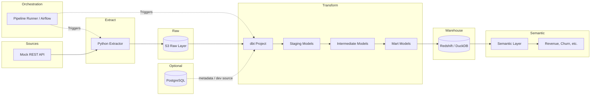

# Architecture Overview

## Purpose

This project models a production-style **e-commerce analytics warehouse**. It demonstrates how raw operational data (orders, products, customers) moves through a medallion-style layering pattern into trusted business metrics that analysts and dashboards can consume.

## High-Level Architecture



## Data Domains

| Domain | Source Endpoint (example) | Raw S3 Path | Primary Keys | Business Use |
|--------|----------------------------|-------------|--------------|--------------|
| **Orders** | `/orders` | `s3://bucket/raw/orders/` | `order_id` | Revenue, AOV, order frequency |
| **Products** | `/products` | `s3://bucket/raw/products/` | `product_id` | Catalog, category mix, margin |
| **Customers** | `/customers` | `s3://bucket/raw/customers/` | `customer_id` | Churn, cohorts, LTV |

## Layering Strategy (Medallion)

### 1. Raw Layer (S3 & Schema Inference)

- **What:** Immutable Parquet/JSON files exactly as returned by the API (plus ingestion metadata).
- **Why:** Replayability, audit trail, and decoupling from upstream API changes.
- **Enterprise Features:** 
  - Uses `asyncio` to extract data concurrently, minimizing latency.
  - Automatically writes highly compressed and partitioned Parquet files to S3.
  - Features **Dynamic Schema Inference** using DuckDB's `read_parquet` and `read_json_auto`. This means new API endpoints or payload schema evolutions instantly land as tables in the warehouse without defining manual DDL.
- **Convention:** Partition by `ingestion_date=YYYY-MM-DD/` and entity type.

### 2. Staging Layer (dbt `stg_*`)

- **What:** Light cleaning—rename columns, cast types, dedupe on load batch.
- **Why:** One consistent interface for all downstream SQL.
- **Materialization:** Views or ephemeral models (cheap to rebuild).

### 3. Intermediate Layer (dbt `int_*`)

- **What:** Joins, business rules, and reusable CTE logic (e.g., order line totals, customer activity windows).
- **Why:** DRY transformations; easier testing and debugging.
- **Materialization:** Views or tables depending on warehouse cost/performance.

### 4. Mart Layer (dbt `mart_*`)

- **What:** Subject-area tables ready for BI (e.g., `mart_orders`, `mart_customers`, `mart_revenue_daily`).
- **Why:** Stable contracts for dashboards and the semantic layer.
- **Materialization:** Tables (Redshift) or tables/incremental (DuckDB).

### 5. Semantic Layer

- **What:** Named metrics and dimensions (revenue, churn rate, active customers) with consistent definitions.
- **Why:** Single source of truth so "revenue" means the same thing everywhere.
- **Implementation:** dbt metrics (YAML), exposure docs, or a thin semantic view layer on top of marts.

## Warehouse Choice: Redshift vs DuckDB

| Aspect | Redshift | DuckDB |
|--------|----------|--------|
| **Use case** | Production / cloud analytics | Local dev, CI, prototyping |
| **S3 integration** | Native `COPY` / Spectrum-style patterns | Read Parquet/CSV from local or S3 via extensions |
| **Cost** | Cluster-based | Free, in-process |
| **dbt adapter** | `dbt-redshift` | `dbt-duckdb` |

The same dbt project can target either warehouse by switching the profile `target`—models and tests stay identical.

## PostgreSQL Role

PostgreSQL typically serves one or more of these roles in this stack:

1. **Mock API backing store** — seed data for the REST API.
2. **dbt metadata / elementary-style observability** — optional.
3. **Application database** — operational source separate from the analytics warehouse.

It is **not** the analytics warehouse in this design; Redshift or DuckDB holds transformed data at scale.

## Non-Functional Requirements

| Requirement | Approach |
|-------------|----------|
| **Idempotency** | Partitioned S3 paths + dbt incremental models where needed |
| **Data quality** | dbt tests (unique, not_null, relationships, custom SQL) |
| **Observability** | Ingestion logs, dbt run artifacts, row-count snapshots |
| **Security** | `X-API-Key` authentication for Mock API endpoints, IAM for S3 encryption, warehouse roles. |
| **Enterprise Scale** | Async multiprocessing extraction, partitioned Parquet format, and automated schema inference for continuous integration. |

## Repository Layout (Recommended)

```
project/
├── docs/                    # This documentation
├── extract/                 # Python ingestion scripts
│   ├── api_client.py
│   ├── s3_writer.py
│   └── run_extract.py
├── dbt_project/             # dbt models, tests, macros
│   ├── models/
│   │   ├── staging/
│   │   ├── intermediate/
│   │   └── marts/
│   ├── tests/
│   ├── macros/
│   └── metrics/
├── infra/                   # Optional: Terraform, Docker
└── README.md
```

See [Workflow](02-workflow.md) for how data moves through each folder.
