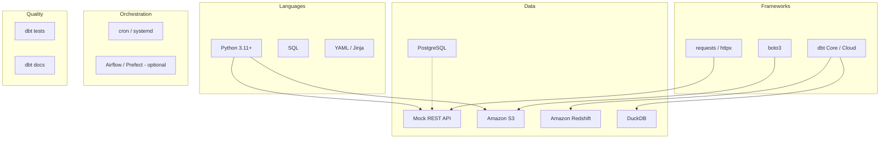

# Tools Stack

Complete reference for every tool in the E-Commerce ELT Data Warehouse, its role, and how to configure it.

---

## Stack Overview



---

## 1. Python

### Role

- HTTP client for mock REST API
- Pagination, retries, error handling
- Write raw payloads to S3 (JSON/Parquet)
- Optional: trigger dbt via subprocess or orchestrator

### Key Libraries

| Library | Purpose |
|---------|---------|
| `requests` or `httpx` | REST API calls |
| `boto3` | S3 upload, IAM auth |
| `pyarrow` / `pandas` | Optional Parquet serialization |
| `python-dotenv` | Local env configuration |
| `tenacity` | Retry with backoff |

### Example Environment Variables

```bash
API_BASE_URL=http://localhost:8000/api/v1
AWS_REGION=us-east-1
S3_BUCKET=ecommerce-raw-data
S3_PREFIX=raw
```

### Skill Applied

Structured error handling, logging, and idempotent file writes—not business transforms in Python.

---

## 2. Mock REST API

### Role

Simulates upstream e-commerce systems exposing `/orders`, `/products`, `/customers`.

### Implementation Options

| Option | Stack |
|--------|-------|
| **FastAPI + PostgreSQL** | Realistic relational source |
| **JSON Server / Mockoon** | Quick static fixtures |
| **Flask + SQLite** | Lightweight local dev |

### Expected Response Shape (Example)

```json
{
  "data": [
    {
      "order_id": "ord_001",
      "customer_id": "cust_42",
      "order_date": "2025-06-20",
      "status": "completed",
      "line_items": [
        { "product_id": "prod_10", "quantity": 2 }
      ]
    }
  ],
  "page": 1,
  "total_pages": 5
}
```

---

## 3. Amazon S3

### Role

**Raw layer** — durable, cheap storage for immutable ingest files.

### Conventions

| Setting | Value |
|---------|-------|
| Bucket | `ecommerce-raw-data` |
| Prefix | `raw/{entity}/ingestion_date={date}/` |
| Format | JSON (flexible) or Parquet (columnar, cheaper queries) |
| Encryption | SSE-S3 or SSE-KMS |
| Lifecycle | Transition to Glacier after N days (optional) |

### IAM Permissions (Minimal)

```json
{
  "Effect": "Allow",
  "Action": ["s3:PutObject", "s3:GetObject", "s3:ListBucket"],
  "Resource": [
    "arn:aws:s3:::ecommerce-raw-data",
    "arn:aws:s3:::ecommerce-raw-data/*"
  ]
}
```

### Redshift Integration

- `COPY` command from S3 into staging tables
- IAM role attached to Redshift cluster for S3 access

### DuckDB Integration

- `INSTALL httpfs; LOAD httpfs;` for S3 reads
- Or sync files locally for offline dev

---

## 4. dbt (data build tool)

### Role

Transform raw/staging data into tested, documented marts and metrics.

### Adapters

| Target | Package | Install |
|--------|---------|---------|
| Redshift | `dbt-redshift` | `pip install dbt-redshift` |
| DuckDB | `dbt-duckdb` | `pip install dbt-duckdb` |

### Project Structure

```
dbt_project/
├── dbt_project.yml      # vars, model paths, materializations
├── profiles.yml         # warehouse connection (keep out of git)
├── models/
│   ├── staging/
│   ├── intermediate/
│   └── marts/
├── macros/
├── tests/
└── metrics/
```

### Core Commands

| Command | Purpose |
|---------|---------|
| `dbt debug` | Validate profile connection |
| `dbt run` | Execute models |
| `dbt test` | Run data quality tests |
| `dbt build` | Run + test in dependency order |
| `dbt docs generate` | Build documentation site |
| `dbt source freshness` | Check raw data staleness |

### profiles.yml Example (DuckDB)

```yaml
ecommerce_dw:
  target: dev
  outputs:
    dev:
      type: duckdb
      path: ./warehouse/ecommerce.duckdb
      threads: 4
```

### profiles.yml Example (Redshift)

```yaml
ecommerce_dw:
  target: prod
  outputs:
    prod:
      type: redshift
      host: cluster.region.redshift.amazonaws.com
      user: dbt_user
      password: "{{ env_var('REDSHIFT_PASSWORD') }}"
      dbname: analytics
      schema: analytics
      port: 5439
      threads: 4
```

---

## 5. Amazon Redshift

### Role

**Production cloud warehouse** — columnar MPP database for large-scale analytics.

### When to Use

- Team needs shared cloud warehouse
- Data volume exceeds local DuckDB comfort zone
- Integration with AWS ecosystem (S3 COPY, IAM, QuickSight)

### Setup Steps

1. Create cluster or Redshift Serverless workgroup
2. Create schemas: `raw`, `staging`, `intermediate`, `marts`
3. Attach IAM role for S3 access
4. Run `COPY` or external tables for raw data
5. Point dbt profile to Redshift

### Performance Tips

- Sort keys on `order_date`, `customer_id`
- Distribution key on `customer_id` for customer-centric joins
- Materialize heavy `int_*` models as tables

---

## 6. DuckDB

### Role

**Local / CI warehouse** — zero-infra analytics database for development and testing.

### When to Use

- Laptop development without AWS costs
- Automated tests in GitHub Actions
- Prototyping dbt models before Redshift deploy

### Setup

```bash
pip install dbt-duckdb duckdb
dbt debug --profiles-dir .
dbt run
```

### S3 Reads (Optional)

```sql
-- In dbt model or macro
select * from read_parquet('s3://bucket/raw/orders/**/*.parquet')
```

---

## 7. PostgreSQL

### Role (in this stack)

| Use Case | Description |
|----------|-------------|
| **API backend** | Stores operational orders/products/customers served by mock API |
| **Metadata** | Optional dbt artifact store or observability tooling |
| **Not** | Primary analytics warehouse (that's Redshift/DuckDB) |

### Connection Pattern

```
PostgreSQL (OLTP)  →  API  →  Python  →  S3  →  dbt  →  Redshift/DuckDB (OLAP)
```

This mirrors real enterprises where operational DBs feed analytics pipelines indirectly.

---

## 8. Supporting Tools (Recommended)

| Tool | Purpose |
|------|---------|
| **Git** | Version control for dbt + Python |
| **Docker / Docker Compose** | Run API + Postgres + local stack |
| **Make / just** | Shortcuts: `make extract`, `make dbt-run` |
| **pre-commit** | SQL formatting (sqlfluff), YAML lint |
| **Airflow / Prefect** | Schedule extract → dbt dependency |
| **GitHub Actions** | CI: `dbt run` + `dbt test` on PR |
| **CloudWatch / logging** | Monitor Python extract jobs |

---

## Tool Selection Matrix

| Requirement | Tool |
|-------------|------|
| Pull from API | Python + requests |
| Store raw files | S3 |
| Transform SQL | dbt |
| Prod warehouse | Redshift |
| Dev warehouse | DuckDB |
| Operational data | PostgreSQL |
| Test data quality | dbt tests |
| Document lineage | dbt docs |
| Schedule jobs | cron / Airflow |

---

## Local Dev vs Production

| Component | Local | Production |
|-----------|-------|------------|
| API | Docker Compose | Deployed service |
| Raw storage | Local MinIO or small S3 bucket | Production S3 bucket |
| Warehouse | DuckDB file | Redshift cluster |
| dbt target | `dev` | `prod` |
| Secrets | `.env` (gitignored) | AWS Secrets Manager / env in CI |

Next: [Problem Solving](05-problem-solving.md)
