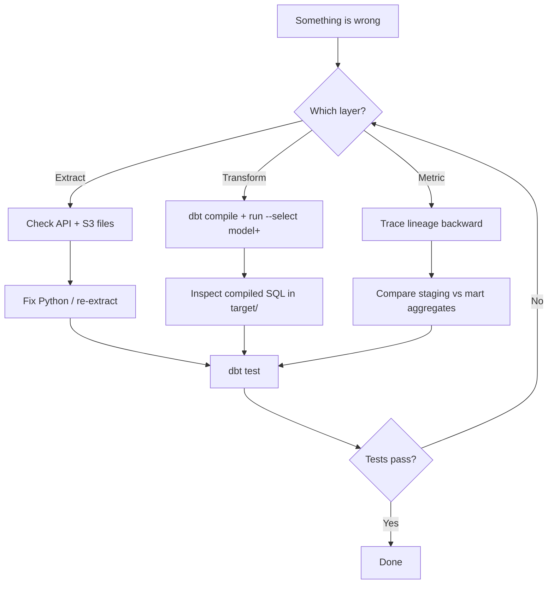

# Problem Solving Skills & Practices

This document maps **real pipeline problems** to **how an analytics engineer thinks and acts**—the skills this project is designed to demonstrate and develop.

---

## Mindset: Analytics Engineering

| Principle | What It Means Here |
|-----------|-------------------|
| **Data as code** | dbt models, tests, and docs live in Git—not one-off SQL in a GUI |
| **Fail fast** | Tests catch bad data before executives see wrong revenue |
| **Reproducibility** | Raw S3 + dbt = rebuild warehouse from scratch |
| **Separation of concerns** | Python extracts; SQL transforms; BI consumes |

---

## Problem Categories & Solutions

### 1. Source System Issues

#### Symptom: API returns 429 / 503

| Step | Action |
|------|--------|
| Diagnose | Check logs for HTTP status and rate-limit headers |
| Fix | Exponential backoff, reduce concurrency, cache pages |
| Prevent | Retry decorator; alert on repeated failures |

**Skill:** Resilient ingestion design—not assuming the API is always available.

#### Symptom: API schema changed (new field, renamed column)

| Step | Action |
|------|--------|
| Diagnose | Compare raw JSON in S3 across ingestion dates |
| Fix | Update `stg_*` model only; marts unchanged if staging absorbs change |
| Prevent | Store raw JSON; parse in dbt; optional JSON schema validation in Python |

**Skill:** **Schema evolution** — isolate upstream change in the staging layer.

---

### 2. Raw Layer / S3 Issues

#### Symptom: Duplicate records in warehouse

| Step | Action |
|------|--------|
| Diagnose | Check if extract re-ran with same logical data, different batch IDs |
| Fix | Dedupe in `stg_*` with `row_number() over (partition by id order by _ingested_at desc)` |
| Prevent | Idempotent keys or merge strategy in incremental models |

**Skill:** **Idempotency** — running the pipeline twice should not double-count revenue.

#### Symptom: Missing partition for today

| Step | Action |
|------|--------|
| Diagnose | `aws s3 ls s3://bucket/raw/orders/ingestion_date=YYYY-MM-DD/` |
| Fix | Re-run extract; check cron/orchestrator |
| Prevent | dbt `source freshness` on raw tables |

**Skill:** **Observability** — know when data didn't arrive before running transforms.

---

### 3. dbt Transform Issues

#### Symptom: `dbt run` fails with compilation error

| Step | Action |
|------|--------|
| Diagnose | Read Jinja compile error; run `dbt compile --select model_name` |
| Fix | Typo in `ref()`, missing model, wrong macro args |
| Prevent | CI runs `dbt compile` on every PR |

**Skill:** **Read compiler output** — Jinja errors point to line numbers in compiled SQL.

#### Symptom: Revenue numbers look wrong

| Step | Action |
|------|--------|
| Diagnose | Trace lineage: `mart_revenue_daily` → `mart_orders` → `int_*` → `stg_*` |
| Fix | Check filters (cancelled orders?), joins (fan-out duplicating rows?), currency conversion |
| Prevent | Singular test `assert_revenue_non_negative`; reconciliation query vs raw sum |

**Skill:** **Lineage-driven debugging** — walk the DAG backward from broken metric to source.

#### Symptom: Relationship test fails (`customer_id` orphan)

| Step | Action |
|------|--------|
| Diagnose | `select * from stg_orders where customer_id not in (select customer_id from stg_customers)` |
| Fix | Late-arriving customers: left join + flag, or default "unknown" customer row |
| Prevent | Document expected referential integrity; sync extract order (customers before orders) |

**Skill:** **Referential integrity** — decide policy for orphans (fail vs quarantine vs default).

---

### 4. Warehouse-Specific Issues

#### Redshift: COPY fails

| Step | Action |
|------|--------|
| Diagnose | `stl_load_errors` system table |
| Fix | JSON path mismatch, IAM role, wrong delimiter |
| Prevent | Validate sample file schema before full COPY |

#### DuckDB: Out of memory locally

| Step | Action |
|------|--------|
| Diagnose | Large cartesian join in intermediate model |
| Fix | Filter early in CTEs; materialize intermediate steps |
| Prevent | Limit dev data volume; use `--select` for subset runs |

**Skill:** **Environment parity** — same dbt logic, different scale tuning per warehouse.

---

### 5. Metric Definition Disputes

#### Symptom: "Churn rate doesn't match finance"

| Step | Action |
|------|--------|
| Diagnose | Document definition: 90-day inactivity? Monthly grain? Active at start? |
| Fix | Align `var('churn_inactive_days')` with stakeholder; update semantic docs |
| Prevent | Metric definitions in dbt YAML + signed-off doc in `docs/` |

**Skill:** **Metric governance** — technology alone doesn't define churn; business agreement does.

---

## Debugging Workflow (Step-by-Step)



### Practical Commands

```bash
# Isolate one model and downstream
dbt run --select stg_orders+

# See compiled SQL
dbt compile --select mart_revenue_daily
cat target/compiled/.../mart_revenue_daily.sql

# Run one test
dbt test --select assert_revenue_non_negative

# Compare row counts
dbt run-operation query --args '{sql: "select count(*) from mart_orders"}'
```

---

## Skills Checklist (What This Project Demonstrates)

### Technical Skills

| Skill | Evidence in Project |
|-------|---------------------|
| REST API integration | Python paginated extract |
| Cloud storage | S3 partitioned raw layer |
| SQL proficiency | CTEs, joins, aggregations, window functions |
| dbt proficiency | Models, macros, tests, docs, vars |
| Jinja templating | `ref`, `source`, `config`, macros, conditionals |
| Data modeling | Staging → intermediate → marts |
| Warehouse ops | Redshift COPY / DuckDB local |
| Data quality | Schema + singular tests |
| Semantic modeling | Revenue and churn definitions |

### Soft / Engineering Skills

| Skill | How It Shows Up |
|-------|-----------------|
| **Structured debugging** | Layer-by-layer isolation |
| **Root cause analysis** | Lineage tracing, not guessing |
| **Documentation** | dbt docs + these markdown guides |
| **Trade-off reasoning** | DuckDB vs Redshift, JSON vs Parquet raw |
| **Stakeholder communication** | Clear metric definitions |
| **Incremental delivery** | Staging first, then marts, then metrics |
| **Defensive coding** | Retries, tests, idempotent writes |

---

## Common Interview / Portfolio Talking Points

Use these when explaining the project:

1. **Why ELT?** Raw lands cheaply in S3; warehouse SQL engines do heavy transforms at scale.
2. **Why CTEs?** Complex order-line logic stays readable and testable in `int_*` models.
3. **Why Jinja vars for churn?** Business can change 90 → 60 days without hunting through SQL files.
4. **Why tests on staging?** Catch bad API data before it inflates revenue in marts.
5. **Why two warehouses?** DuckDB for fast local iteration; Redshift for production parity.

---

## Incident Playbook (Quick Reference)

| Alert | First Check | Likely Fix |
|-------|-------------|------------|
| Extract job failed | API health, credentials | Retry extract |
| dbt test failed | `dbt test --store-failures` | Fix staging dedupe or source sync |
| Revenue spike | Fan-out join in `int_*` | Fix grain; add uniqueness test |
| Churn dropped to 0 | Var or date logic bug | Review `int_customer_activity` |
| S3 costs high | Raw format, lifecycle | Switch to Parquet; archive old partitions |

---

## Further Learning Path

1. Add **incremental models** on `mart_orders` for scale practice.
2. Wire **Airflow** to chain extract → dbt with sensors.
3. Add **Elementary** or custom observability for anomaly detection.
4. Implement **slowly changing dimensions** (SCD2) on `dim_customers`.
5. Expose metrics via **Cube** or **MetricFlow** semantic layer.

---

## Related Documentation

- [Architecture Overview](01-architecture-overview.md)
- [Workflow](02-workflow.md)
- [Techniques & Implementation](03-techniques-and-implementation.md)
- [Tools Stack](04-tools-stack.md)
